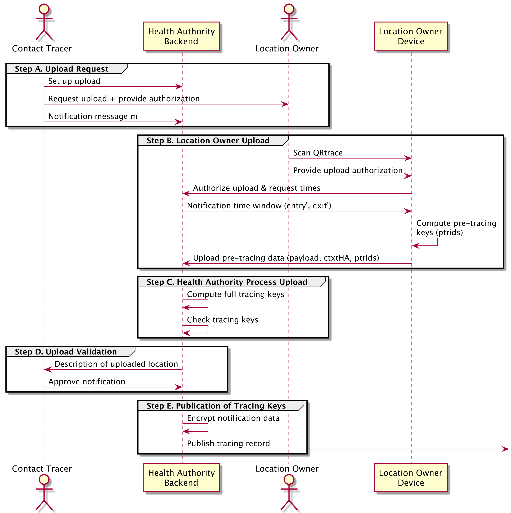

.. _basic-crowdnotifier:

*******************
Basic CrowdNotifier
*******************

The basic CrowdNotifier scheme equals the scheme presented in the white paper. The scheme we present here has some modifications to incorporate some new insights that simplify the QR codes.

In this scheme, generating notifications requires cooperation of both the :term:`Location Owner` and the :term:`Health Authority`.

Global Setup
============
This document fixes specific algorithm choices for the cryptographic schemes as well as the cryptographic parameters of these schemes. We refer to :ref:`the section on Cryptographic Building Blocks <building-blocks>` for the details on these instantiations. We assume these algorithms and parameters are public.

Setting up a Health Authority
=============================

The :term:`Health Authority` generates a public-private encryption key pair :math:`\pkH, \skH` by running :math:`\keygen` of the public-key encryption algorithm. The health authority publishes :math:`\pkH` and privately stores :math:`\skH` at the :term:`Health Authority Backend`.

This key-pair provides an extra layer of privacy protection for encrypted visits stored on a user's phone. To decrypt these visits, an attacker would need to obtain both `\skH` as well as the private information stored by the :term:`Location Owner`.

Since we use ``libsodium``, the health authority simply runs ``crypto_box_keypair`` to generate this key-pair.

.. _basic-setting-up-location:

Setting-up a Location
=====================

To set up a :term:`Location` the :term:`Location Owner` runs the setup program. This program will output two QR codes: a public QR code :math:`\qrentry` and a private QR code :math:`\qrtrace`. For security reasons, this setup program must run client-side. We propose to use client-side JavaScript to statelessly generate the PDFs containing the QR codes.

The :term:`Location Owner` provides a description of the location (e.g., name, address, type). Setup then proceeds as follows. It computes two IBE key pairs (one for the location, and one for the health authority)

.. math::

  (\masterpkvenue, \masterskvenue) &\gets \ibekeygen(\pp),

  (\masterpkhealth, \masterskhealth) &\gets \ibekeygen(\pp)

and computes :math:`\masterpk = \masterpkvenue \cdot \masterpkhealth \in \group_2`. It encrypts the master secret key :math:`\masterskhealth` for the health authority by creating the ciphertext :math:`\ctxtha = \enc(\pkH, \masterskhealth)`. It deletes and does not store the value :math:`\masterskhealth`. Finally, it picks a random 32-byte seed :math:`\seed`.

In code, the setup script computes the following values:

.. code-block:: javascript

   // Input: the public key pkha of the Health Authority

   // Generate IBE key pairs
   const [mpkl, mskl] = IBEKeyGen();
   const [mpkha, mskha] = IBEKeyGen();

   // Compute resulting master public key
   const mpk = mcl.add(mpkl, mpkha);

   // Compute encrypted master secret key for health authority
   const ctxtha = crypto_box_seal(mskha.serialize(), pkha);

   // Generate seed
   const seed = randombytes_buf(32);

The setup program then encodes these values into two QR codes:

1. The entry QR code :math:`\qrentry` containing the description of the location, :math:`\masterpk` and the seed :math:`\seed`.
2. The tracing QR code :math:`\qrtrace` containing the same values as :math:`\qrentry` and additionally :math:`\masterskvenue` and :math:`\ctxtha`.

To provide strong abuse-prevention properties, it is essential that the setup procedure does not store the master private key :math:`\masterskhealth`. By only storing the encrypted version :math:`\ctxtha`, both the data stored securely in the tracing QR code :math:`\qrtrace` as well as cooperation of the :term:`Health Authority` (to decrypt :math:`\ctxtha`) are needed to compute tracing keys. As a result, the :term:`Location Owner` is protected against coercion attacks.

.. _entry-code-format:

Entry QR Code Format
--------------------

.. warning::

   The precise QR code format might see some minor updates in the near future.

CrowdNotifier adopts a standard payload format to encode data into the QR code :math:`\qrentry` that is scanned by visitors. We use the following standard protobuf format:

.. literalinclude:: protobufs/qrcodepayload.proto
   :language: protobuf

The setup program includes the description of the location in the ``TraceLocation`` structure. It adds potential other country-specific information to the ``countryData`` field. The ``startTimestamp`` and ``endTimestamp`` denote the validity time of this QR code.

The ``CrowdNotifierData`` structure encodes the CrowdNotifier elements as described above. The ``publicKey`` field encodes the master public key :math:`\masterpk` as a byte array. We use mcl's serialization format. See :ref:`the section on serialization for more details <mcl-serialization>`. The ``cryptographicSeed`` fields encode the 32-byte seed :math:`\seed` as a byte array. 

.. note::

   The QR code format does not include a country code.
   Instead, apps should use the URL embedded in the QR code
   to deduce the corresponding country.

.. todo

   Pick deliberate values for the ``version`` fields. For now, assuming they'll be set to 1. Also not sure what the ``type`` field should be set to.

Finally, the payload protobuf must be encoded into a QR code. There are different methods for doing this. The most obvious approach is to encode a URL in the QR code that includes the encoded payload protobuf.

.. admonition:: NotifyMe

   The NotifyMe app encodes the following URL in the QR code:

   .. code::

      https://qr.notify-me.ch?v=3#<base64-encoded-protobuf>

   Users scan this QR code either directly with the corresponding app, or with
   their camera application. When the app is not installed, phones open this url
   in the browser. Including the payload after the anchor tag ensures that it is
   not sent to the server. Ensuring that the server doesn't learn which
   locations the user is visiting.

.. _basic-visiting-location:

Visiting a Location
===================
Upon entering a :term:`Location`, the user uses their app to scan the corresponding entry QR code :math:`\qrentry` and obtain the values encoded therein. The app shows a description of the location based on the information in the ``locationData`` and ``countryData`` fields. Then the app asks for confirmation that the user wants to check in.

At this point the app stores the check-in time. After a while, the app learns that the user left the :term:`Location`. Several mechanisms are possible:

* That app sends a reminder to the user after at time chosen during check-in
* The QR code contains a default time, and checks the user out automatically.

In both cases, it might be helpful if apps allow users to adjust the check-in and check-out times to reflect the actual time in the :term:`Location`. So that the app can store the correct records, even if the user only remembers to checkout later.

Given the arrival time ``arrival time`` and departure time ``departure time``, as well as the master public key :math:`\masterpk` and seed :math:`\seed` encoded in the ``CrowdNotifierData`` part of the payload, the app proceeds as follows:

1. The app uses the QR code payload :math:`\payload` to compute the notification
   key :math:`\notificationkey` and the time-specific identities :math:`\id`
   using :ref:`the process detailed in the next
   section<basic-computing-identities>`.

2. The app encodes a record :math:`m` capturing the arrival and departure times,
   as well as the notification key :math:`\notificationkey`:

   .. math::

      m = (\texttt{arrival time},\enspace \texttt{departure time},\enspace \notificationkey)

3. For each identity :math:`\id` computed in step 1, the app computes the ciphertext

   .. math::

      \ctxt \gets \ibeenc(\masterpk, \id, m)

   and stores it together with a label for the current day. The app does not
   store any of the other data computed as part of this process.

The following code-block shows an example.

.. code-block:: javascript

   // Calculate the MessagePayLoad m as a JSON string
   const messagePayload: MessagePayload = {
     arrivalTime: arrivalTime,
     departureTime: departureTime,
     notificationKey: venueInfo.notificationKey,
   };
   const msgPBytes = from_string(JSON.stringify(messagePayload));

   // Encrypt the record m using the IBE scheme
   const ctxt = enc(masterPublicKey, identity, msgPBytes);

Devices automatically delete any entry older than 10 days.

.. _basic-computing-identities:

Computing Identities and Keys
-----------------------------

As part of the process to visit a :term:`Location`, the app computes time-specific identities corresponding to the user's visit to this :term:`Location`. These time-specific identities correspond to time intervals that overlap with the user's visit. Currently, these intervals are all exactly 1 hour long, corresponding to a interval length of ``intervalLength = 60*60 = 3600`` seconds. But the following specification supports different interval lengths.

1. The app derives three 32-byte values :math:`\noncepreid`, :math:`\noncetimekey`, and
   :math:`\notificationkey` from the QR code using HKDF:

   .. math::

      \noncepreid \parallel \noncetimekey \parallel \notificationkey = \code{HKDF}(96, \payload, \texttt{""}, \cnversionstring)

   where the input key material :math:`\textrm{payload}` is the raw protobuf
   (e.g., after base64 decoding, but before parsing), the salt is empty, and
   ``"CrowdNotifier_v3"`` is the info string.

   The 32-byte ``cryptographicSeed`` in the payload ensures that the input key
   material has sufficient entropy. By using the entire payload as input key
   material rather than only this seed, we ensure maximal entropy, even if the
   ``cryptographicSeed`` is shorter.

2. The app computes a pre-identity for the :term:`Location`:

   .. math::

      \preid = \sha(\texttt{"CN-PREID"} \parallel \payload \parallel \noncepreid)

   The input to the hash-function is the concatenation of 3 byte arrays: the ASCII encoded 8-byte string ``CN-PREID`` for domain separation, then the raw payload, and finally the 32-byte nonce :math:`\noncepreid`.

3. For each supported interval length :math:`\intervalLength` in seconds (currently only 1 hour, corresponding to 3600 seconds, is used) compute the interval start times :math:`\intervalStart` (in seconds since UNIX epoch) for all intervals of length :math:`\intervalLength` that overlap with the user's visit. The start times must be aligned with the start of the interval, e.g., ``intervalStart % intervalLength == 0``.

4. For each interval length :math:`\intervalLength` (in seconds), and interval start time :math:`\intervalStart` (in seconds since UNIX epoch) compute the corresponding identity key :math:`\timekey`:

   .. math::

      \timekey = \sha( \texttt{"CN-TIMEKEY"} \parallel \intervalLength \parallel \intervalStart \parallel \noncetimekey),

   where the inputs to the hash-function is the concatenation of the following values:

   * The 8-byte ASCII encoding of the string ``CN-TIMEKEY``
   * The 4-byte big-endian encoding of the value :math:`\intervalLength`
     (``900 <= intervalLength <= 86400``)
   * The 8-byte big-endian encoding of :math:`\intervalStart`
   * The 32-byte nonce :math:`\noncetimekey`.

   Next, compute the corresponding time-specific identity

   .. math::

      \id = \sha( \texttt{"CN-ID"} \parallel \preid \parallel \intervalLength \parallel \intervalStart \parallel \timekey),

   where the inputs to the hash-function is the concatenation of the following values:

   * The 5-byte ASCII encoding of the string ``CN-ID``
   * The 32-byte SHA256 output :math:`\preid`
   * The 4-byte big-endian encoding of the value :math:`\intervalLength`
     (``900 <= intervalLength <= 86400``)
   * The 8-byte big-endian encoding of :math:`\intervalStart`
   * The 32-byte SHA256 output :math:`\timekey`

In code, the app proceeds as follows:

.. code-block:: javascript
 
   // Calculate the values using the HKDF
   const hkdf = require('futoin-hkdf');

   const ikm = qrCodePayload;
   const length = 96;
   const salt = ''; // salt is empty
   const info = 'CrowdNotifier_v3';
   const hash = 'SHA-256';

   const derivedBuffer: Uint8Array = hkdf(ikm, length, {salt, info, hash});
   const noncepreid = derivedBuffer.slice(0, 32);
   const noncetimekey = derivedBuffer.slice(32, 64);
   const notificationKey = derivedBuffer.slice(64, 96);
 
   // Calculate the pre-identity for the Location
   const preid = crypto_hash_sha256(
       Uint8Array.from([
         ...from_string('CN-PREID'),
         ...qrCodePayload,
         ...noncepreid,
       ]),
   );
 
   // Currently only one intervalLength is supported
   const intervalLength = 3600;
 
   // `intervals` contains the `intervalStart` times for the whole duration of the
   // visit.
   const ids = intervals.map((id) => {
     timekey = crypto_hash_sha256(
           Uint8Array.from([
             ...from_string('CN-TIMEKEY'),
             ...toBytesInt32(intervalLength),
             ...toBytesInt64(intervalStart), // timestamp might use up to 8 bytes
             ...noncetimekey,
           ]),

     id = crypto_hash_sha256(
           Uint8Array.from([
             ...from_string('CN-ID'),
             ...preid,
             ...toBytesInt32(intervalLength),
             ...toBytesInt64(intervalStart), // timestamp might use up to 8 bytes
             ...timekey,
           ]),
       )
     return id;
     });

.. _basic-initiate-tracing:

Initiating Presence Notification
================================

After the contact tracing team of the :term:`Health Authority` has determined that a SARS-CoV-2-positive person has visited a location during the contagious period, they proceed as follows. Let :math:`\entryplus` and :math:`\exitplus` be the times that the SARS-CoV-2-positive person entered and exited this location. See :numref:`fig-upload-sequence` for an overview.

.. _fig-upload-sequence:

   Overview of process to initiate presence notification

*  *Step A (upload request).*
   The contact tracing team contacts the :term:`Location Owner` of the
   :term:`Location` and requests an upload of the hour-specific pre tracing keys to
   the health authority's servers. They also provide the :term:`Location Owner`
   with a means to authenticate this upload, for example a one-time token.
   Finally,
   the tracing team specifies a message :math:`m`
   that should be sent to the notified users.
   They upload this message to the :term:`Health Authority Backend`.

*  *Step B (location owner upload).*
   The location owner scans the tracing QR code :math:`\qrtrace` with their app
   to obtain the payload :math:`\payload` of the entry QR code, as well as the
   values :math:`\masterskvenue` and :math:`\ctxtha`. The app then proceeds as
   follows

   1. The app authenticates to the :term:`Health Authority Backend` (e.g., using
      the one-time token) and obtains the :math:`\entryplus` and
      :math:`\exitplus` times corresponding to the index case.

   2. The app uses the QR code payload :math:`\payload` and the times
      :math:`\entryplus` and :math:`\exitplus` to compute the relevant time-specific
      identities :math:`\id` using :ref:`the process detailed in the next
      section<basic-computing-identities>`.

   3. For each identity :math:`\id` computed in the previous step it computes
      the partial identity-based decryption key

      .. math::

         \preskidvenue = \ibekeyder(\masterskvenue, \id).

      Let the pre-tracing key be :math:`\pretrace_{\id} = (\id, \preskidvenue)`.

   4. The app uploads :math:`\payload`, :math:`\ctxtha`, and all pre-tracing
      keys :math:`\pretrace_{\id}` to the :term:`Health Authority
      Backend`.

*  *Step C (health authority process upload).*
   The health authority's system processes each upload as follows.

   1. It decrypts :math:`\ctxtha` to obtain :math:`\masterskhealth`.

   2. It uses the QR code payload :math:`\payload` and the times
      :math:`\entryplus` and :math:`\exitplus` to recompute the relevant time-specific
      identities :math:`\id` using :ref:`the process detailed in the next
      section<basic-computing-identities>`.

   3. It parses the pre-tracing keys :math:`\pretrace_{\id}` as :math:`(\id,
      \preskidvenue)` and discards any entries with identities :math:`\id` it did
      not compute in the previous step. Next, it computes its part of the
      identity-based decryption key

      .. math::

         \preskidhealth = \ibekeyder(\masterskhealth, \id).

      and computes the final identity-based decryption key

      .. math::

         \skid = \preskidvenue \cdot \preskidhealth.

      Let :math:`\traceid = (\id, \skid)`.

   4. It validates the computed tracing key :math:`\traceid = (\id, \skid)`.
      To do so, it picks a random message :math:`m` of sufficient length and
      computes the ciphertext :math:`\ctxt \gets \ibeenc(\masterpk,
      \id, m)`, and verifies that :math:`\ibedec(\skid,
      \id, \ctxt) = m`. If the check fails, it removes the upload.

*  *Step D (upload validation).*
   The contact tracing team checks that
   the uploaded tracing-keys correspond to the expected :term:`Location`.
   To do so,
   they compare the description of the location in the supplied :math:`\payload`
   with the expected location.
   This validation step could happen automatically.

*  *Step E (publication of tracing keys).*
   To publish the tracing keys,
   the :term:`Health Authority Backend` proceeds as follows:

   1. The server formats creates notification data :math:`\notificationdata`
      that contains the message :math:`m` (specified in step A)
      as well as information about the notification interval.
      This package also contain extra machine-readable information
      such as the severity of the warning:

      .. math::

         \notificationdata = (\entryplus, \exitplus, m)

      see :ref:`the definition of AssociatedData below<server-data-formats>`
      for a concrete ProtoBuf based instantiation.

   2. Finally,
      the :term:`Health Authority Backend` uses :math:`\payload`
      to recompute the notification key :math:`\notificationkey`
      and computes
      :math:`\ctxtnotificationdata = \aeenc(\notificationkey,\allowbreak \notificationdata)`,
      the encrypted message for the notified visitors,
      and for each relevant timeslot it publishes a
      record :math:`(\traceid, \dayctr, \ctxtnotificationdata),`
      where :math:`\dayctr` corresponds to the day (since the UNIX epoch) on which this timeslot begins.
      See :ref:`the definitions of ProblematicEvent and ProblematicEventWrapper below<server-data-formats>`
      for concrete ProtoBuf based instantiations.

.. note::

   As for DP3T-based application,
   the :term:`Health Authority Backend` should publish tracing records via a CDN
   to facilitate downloading by millions of clients.

.. _server-data-formats:

Data Formats
------------

The CrowdNotifier uses the following standard encrypted payload format to encode :math:`\notificationdata`:

.. literalinclude:: protobufs/associateddata.proto
   :language: protobuf

This data structure follows the same structure as :ref:`the entry QR code format<entry-code-format>` defined above. The ``countryData`` can be used to insert other country-specific information. It is currently not used.

The per time-slot event data :math:`(\traceid, \dayctr, \ctxtnotificationdata)` is wrapped in a ``ProblematicEvent``:

.. literalinclude:: protobufs/problematicevent.proto
   :language: protobuf

Recall that :math:`\traceid = (\id, \skid)`. In the ``ProblematicEvent`` protobuf, ``identity`` encodes :math:`\id`, and  ``day`` encodes the start of day (in seconds since UNIX Epoch).

The field ``secretKeyForIdentity`` encodes :math:`\skid` :ref:`serialized as per the specification in the building blocks section<mcl-serialization>`.
The ciphertext :math:`\ctxtnotificationdata` is
encoded by ``encryptedAssociatedData`` and ``cipherTextNonce``.
The ciphertext follows the ``libsodium`` encoding,
see :ref:`the cryptographic building blocks<symmetric-encryption>` for more details.

A sequence of such tuples is wrapped in a single ``ProblematicEventWrapper``.

.. _basic-presence-notification:

Presence Tracing and Notification
=================================

The user’s app regularly (say, every few hours) performs the following checks:

1. The app downloads all :math:`(\traceid, \dayctr, \ctxtnotificationdata)` tuples
   that were published since the last time it checked.

2. For each tuple downloaded :math:`(\traceid, \dayctr, \ctxtnotificationdata)` let 
   :math:`\traceid = (\id, \skid)`. The app proceeds as follows.

   1. For each record :math:`\ctxt` recorded on a day 
      corresponding to :math:`\dayctr`, the app tries to decrypt it using
      :math:`\ibedec(\id,\allowbreak \skid,\allowbreak \ctxt)`. The app
      selects records where decryption succeeds (i.e., those not equal to
      :math:`\bot`).

   2. For all selected records :math:`\ctxt`, the app uses the plaintext of
      :math:`\ctxt` to recover the arrival time, departure time and the
      notification key :math:`\notificationkey`.

   3. The app then uses :math:`\notificationkey`
      to decrypt :math:`\ctxtnotificationdata` and recover:

      .. math::

         \notificationdata = (\entryplus, \exitplus, m)

      if decryption fails, it moves on to the next matching tuple.

   4. The app checks if there is an overlap between
      the user's time at the location
      and what is indicated by :math:`\entryplus` and :math:`\exitplus`.
      If there is an overlap,
      the app uses :math:`m` to notify the user.
